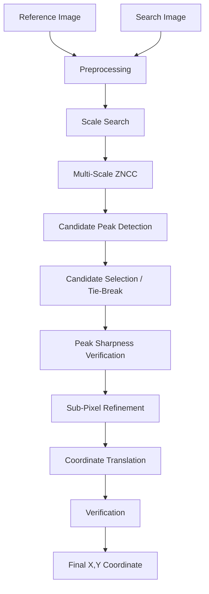

# Drift-Sense: Precision Wafer Localization Engine

Drift-Sense is a deterministic, classical computer‑vision image‑registration and localization engine. It locates a small reference image (template) inside a much larger search image that contains highly periodic, semiconductor‑style structures. The implementation is designed to handle scale mismatch, sensor noise, and sub‑pitch periodic ambiguity without using ground‑truth metadata or learned models.


## Overview

Template localization on wafer imagery is challenging because many structures are highly repetitive: identical or near‑identical motifs repeat at sub‑pitch intervals. Naive template matching produces multiple similarly high correlation peaks corresponding to these repeats, making it ambiguous which peak corresponds to the intended reference region.

Typical failure modes:

Reference image
        ↓
Search image
        ↓
Scale mismatch → the spatial period can change
        ↓
Periodic ambiguity → multiple correlation peaks
        ↓
Multiple candidate peaks → need deterministic disambiguation
        ↓
Candidate verification → check structural similarity
        ↓
Sub‑pixel localization → refine to continuous coordinates

Drift‑Sense addresses each step with deterministic signal‑processing and image‑processing components (no ML): preprocessing, multi‑scale search, FFT‑based ZNCC, morphological peak detection and NMS, center‑aware tie‑breaking, local sharpness verification, sub‑pixel refinement, and a final verification stage.

## Key Features

- Multi‑scale search (coarse → fine → ultra‑fine): robust to modest magnification drift; narrows candidate scales before expensive matching.
- FFT‑based Zero‑Mean Normalized Cross‑Correlation (ZNCC): efficient production matcher for dense response maps (zncc.py).
- Candidate peak detection: morphological local‑maximum extraction and thresholding to find valid peaks (peak_detector.py).
- Non‑Maximum Suppression (NMS): avoids selecting clusters of nearby maxima as separate candidates.
- Center‑aware disambiguation: deterministic tie‑breaking that prefers the candidate nearest the image center when scores are ambiguous.
- Peak sharpness verification: local 3×3 annulus sharpness metric used to help resolve top‑2 intensity ties.
- Sub‑pixel refinement: 1D parabolic interpolation along X and Y for continuous coordinate estimation (subpixel.py).
- Synthetic dataset generation: procedural FinFET‑style dataset generator and CLI for controlled evaluation (generate_dataset.py / src/drift_sense/dataset.py).
- Standalone CLI and programmatic API: a minimal CLI (inference.py) and Python entrypoints for batch or single inference runs.
- Automated tests: unit and integration tests under `tests/` to exercise core modules.

Each feature is present in the repository; descriptions above indicate the reason the component exists (robustness, efficiency, determinism).

## How Drift‑Sense Solves the Problem (Algorithm — implementation order)

The implementation in src/drift_sense/matcher.py orchestrates the pipeline in the following order. For each stage below, the input, operation, and output are described.

1. Image loading and validation
   - Input: reference and search image file paths
   - Operation: validate file paths exist; load images later in preprocessing
   - Output: file paths validated (validate_image_path)

2. Preprocessing
   - Input: image files
   - Operation: grayscale load, optional CLAHE / blur, z‑score normalization to float32 (preprocess.py)
   - Output: normalized float32 arrays ready for numerical matching

3. Reference/search pairing validation
   - Input: normalized arrays
   - Operation: ensure reference is strictly smaller than search image in both dims (validate_reference_search_pairing)
   - Output: gating check to avoid invalid correlation

4. Scale estimation (top‑N)
   - Input: normalized reference and search
   - Operation: PSD heuristic (optional) → coarse grid scoring (fast cv2.matchTemplate proxy) → fine & ultra‑fine refinement (scale_search.py)
   - Output: a short list of fully refined scale candidates (estimate_top_n_scales)

5. Multi‑scale matching (per candidate)
   - Input: each candidate scale
   - Operation: resize the reference to the scale, compute FFT‑ZNCC against the search image to obtain a dense response map (compute_zncc_fft)
   - Output: response map per scale

6. Candidate peak detection
   - Input: response map
   - Operation: morphological NMS (dilation), threshold by response delta, build PeakCandidate list and deterministically sort by score then distance to center (peak_detector.detect_peaks)
   - Output: sorted candidate list

7. Deterministic candidate selection / tie‑break
   - Input: sorted candidates
   - Operation: if top‑1 score gap > delta → choose top‑1; otherwise collect all candidates within delta and pick the one nearest the center (peak_detector.select_best_peak)
   - Output: integer (x, y) peak coordinate in response‑map space

8. Local peak sharpness and ambiguity handling
   - Input: response map and chosen peak
   - Operation: compute 3×3 annulus sharpness (peak_detector.get_sharpness); when the top‑2 intensity gap is below a configured threshold, compare sharpness and optionally select the sharper candidate (or keep top‑1)
   - Output: possibly alternative candidate chosen when ambiguity exists

9. Sub‑pixel refinement
   - Input: integer peak coordinate in response map
   - Operation: independent 1D parabolic interpolation along X and Y to compute dx, dy, clamp by config bounds (subpixel.refine_subpixel)
   - Output: refined (x, y) in response‑map coordinates

10. Coordinate translation and verification
    - Input: sub‑pixel coordinates, scaled reference size, and the search image
    - Operation: translate response‑map coordinate to a center (x, y) in the search image; extract a sub‑pixel crop and compute verification scores (intensity ZNCC + gradient ZNCC) to produce a combined confidence and a pass/fail flag (verification.verify_match)
    - Output: final InferenceResult containing prediction, scale used, confidence, fallback flag, execution time, and message

This flow is fully deterministic and implemented end‑to‑end in Python (no GPU or external inference frameworks are required).

## Technical Architecture

| Module | Responsibility |
|--------|----------------|
| inference.py (root) | Minimal CLI wrapper used for evaluator compatibility (prints single tuple to stdout). Also provided under src/drift_sense/inference.py for programmatic use. |
| src/drift_sense/matcher.py | End‑to‑end inference orchestrator: validation, preprocessing, scale estimation, per‑scale matching, candidate collection, disambiguation, verification, and assembly of InferenceResult. |
| src/drift_sense/scale_search.py | Multi‑stage scale estimation: optional PSD prior, coarse grid scoring (fast proxy), and fine/ultra‑fine refinement to produce candidate scales (estimate_top_n_scales and estimate_scale). |
| src/drift_sense/zncc.py | FFT‑based production ZNCC implementation (compute_zncc_fft) and a spatial reference implementation for testing/validation. Also contains local statistics helpers and response validation. |
| src/drift_sense/peak_detector.py | Peak detection pipeline: morphological NMS, score thresholding, candidate construction/sorting, deterministic center‑aware tie‑breaking, and local sharpness metric. |
| src/drift_sense/subpixel.py | Sub‑pixel refinement using separable 1D parabolic interpolation for X and Y, with numerical safeguards. |
| src/drift_sense/preprocess.py | Image I/O and preprocessing: grayscale load, CLAHE, blurs, and z‑score normalization. |
| src/drift_sense/dataset.py (+ generate_dataset.py) | Procedural synthetic dataset generation (FinFET‑style) for controlled evaluation; writes ground‑truth JSON with each sample. |
| src/drift_sense/validate.py | Input validation helpers (image path checks, array shape/dtype checks, reference/search size gating). |
| src/drift_sense/verification.py | Structural verification of the predicted crop against the scaled reference using combined intensity and gradient ZNCC. |
| src/drift_sense/types.py | Shared dataclasses and type aliases (Coordinate, InferenceResult, ImageArray). |

All modules include unit‑testable functions and clear architectural contracts (see module docstrings for details).

## Algorithm Diagram



(Note: the diagram corresponds to the implementation in src/drift_sense/matcher.py and submodules.)

## Evaluation and Results

A synthetic evaluation summary is included at `results/summary.json` (50 synthetic FinFET‑style samples). Key metrics from that file:

- Samples: 50
- ≤1 px accuracy: 52.0%
- ≤2 px accuracy: 88.0%
- ≤5 px accuracy: 100.0%
- Mean error: ~1.085 px
- Median error: ~0.987 px
- Maximum error: ~3.076 px
- Mean runtime: ~2.766 s/sample

These numbers reflect offline synthetic evaluation using the repository tools and are provided for reproducibility and comparison. They do not imply guaranteed field performance on unseen real inspection data.

## Usage

Install requirements and run the CLI. A Python 3.8+ runtime is required.

```bash
git clone https://github.com/Yukanthdayalan/drift-sense
cd drift-sense
python -m venv .venv
# Activate venv (platform dependent)
pip install -r requirements.txt

# Single inference (prints one mandatory line to stdout for evaluator compatibility)
python inference.py <reference.png> <search.png>

# Optionally write a JSON result
python inference.py <reference.png> <search.png> --output output.json
```

Programmatic use (example):

```python
from drift_sense.inference import run_inference
res = run_inference('ref.png', 'search.png')
print(res.prediction.x, res.prediction.y)
```

## Generating synthetic datasets

Generate a small FinFET‑style synthetic dataset for local testing:

```bash
python generate_dataset.py --architecture finfet --num-pairs 30 --output-dir evaluation_dataset
```

Each generated pair includes `reference.png`, `search.png`, and `ground_truth.json` with the absolute center coordinate used for offline evaluation.

## Testing

Run the existing pytest suite:

```bash
python -m pytest -q
```

## Limitations & Notes

- Deterministic, classical CV pipeline — no neural networks or learned models are used.
- No GPU‑specific codepaths are present; the implementation runs on CPU.
- Evaluation results are from synthetic datasets generated within this repository; they should not be taken as guaranteed performance on production inspection data.
- The scale search is configured with bounded min/max scale values — for extreme magnification differences adjust the scale_search configuration.

## Contribution & Contacts

Contributions that preserve the deterministic architecture and include tests are welcome. For reproducibility issues or questions about module contracts, inspect the module docstrings in `src/drift_sense/` and the test cases in `tests/`.

---

This README was written to reflect the repository implementation and packaged evaluation artifacts exactly. If you want, I can also add a short developer section summarizing the main configuration knobs and where to change them (NMS radius, tie delta, subpixel max offset, scale grid steps).